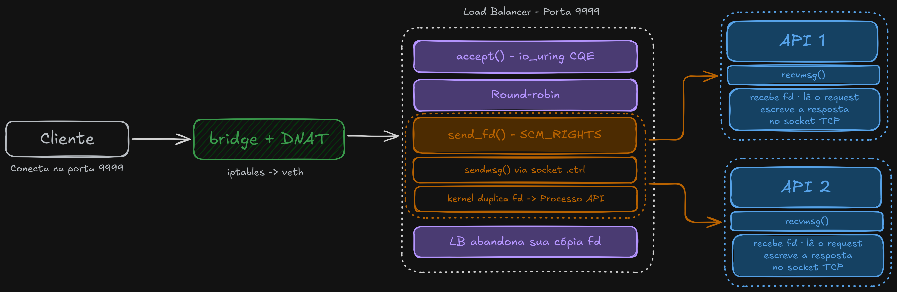

# SoNoForevis

Load balancer TCP de alta performance escrito em Rust com [monoio](https://github.com/bytedance/monoio) (io_uring), desenvolvido para a **[Rinha de Backend 2026](https://github.com/zanfranceschi/rinha-de-backend-2026)**.

---

## Como funciona

A abordagem convencional de load balancer opera no _data path_: aceita a conexão TCP, lê bytes do cliente e os escreve no upstream, sendo um intermediário ativo em toda a troca de dados.

Este projeto elimina esse overhead usando **`SCM_RIGHTS`**, um mecanismo do kernel Linux que permite transferir file descriptors entre processos via Unix Domain Sockets.

---

## Arquitetura



| Componente | Responsabilidade |
|---|---|
| Load balancer | Aceita conexões TCP; distribui fds em round-robin via `AtomicUsize`; envia fd por `.ctrl` socket (UDS) |
| API (×2) | Escuta no socket de controle `.ctrl`; recebe fds com `recvmsg()`; |

**Runtime:** monoio com `IoUringDriver` · `WORKERS=1` · backlog de 65.535 conexões · `SO_REUSEPORT` habilitado

---

## Variáveis de ambiente

| Variável | Padrão | Descrição |
|---|---|---|
| `PORT` | `8080` | Porta TCP onde o load balancer escuta |
| `UPSTREAMS` | — | **Obrigatório.** Caminhos UDS separados por vírgula (ex.: `/run/api1,/run/api2`) |
| `WORKERS` | paralelismo disponível | Número de threads worker (cada uma com seu próprio runtime io_uring) |

---

## Rodando localmente

### Pré-requisitos

- Kernel Linux ≥ 5.1 (io_uring)

## SCM_RIGHTS é mais eficiente que proxy tradicional

Em um proxy TCP convencional, o load balancer percorre o caminho completo dos dados:

```
Cliente → LB: read() → buffer → write() → API
API     → LB: read() → buffer → write() → Cliente
```

Isso implica em pelo menos **4 syscalls e 2 cópias de memória** por requisição, além de manter o processo do load balancer no caminho crítico durante toda a duração da conexão.

Com `SCM_RIGHTS`, o kernel passa a propriedade do file descriptor (internamente um ponteiro para `struct file`) para o processo receptor. A transferência é **uma chamada `sendmsg()`** contendo apenas um byte de dados e o fd como ancillary data. A partir daí:

- O load balancer **não bloqueia** aguardando resposta
- Não há buffer intermediário
- Não há cópia de dados no espaço do usuário
- O fd no processo receptor se comporta como se tivesse sido criado com `dup(2)` — é um handle completo para o socket TCP original
---

## Compilação manual

```bash
# Otimizado para Haswell (target da competição)
RUSTFLAGS="-C target-cpu=haswell" cargo build --release

# Binário gerado em:
./target/release/SoNoForevis
```

O perfil de release usa LTO fat, codegen-units=1 e strip para maximizar performance e minimizar tamanho do binário.

---

## Referências

### Cloudflare - "Know your SCM_RIGHTS"
**Vlad Krasnov, 2018** · https://blog.cloudflare.com/know-your-scm_rights/

Referência de produção em escala global usando `SCM_RIGHTS` para passar sockets TCP entre processos em linguagens diferentes (nginx em C → handler TLS 1.3 em Go). A arquitetura é estruturalmente idêntica: um processo aceita conexões e passa os fds para workers especializados via UDS. Artigo fundamental para esse projeto.

### "The Linux Programming Interface" - Michael Kerrisk
https://man7.org/tlpi/

Livro de sistemas Unix/Linux. O capítulo de sockets possui uma seção completa de `SCM_RIGHTS` com exemplos de código (`scm_rights_send.c` e `scm_rights_recv.c`). Referência primária para entender o comportamento de ancillary data, alinhamento de `cmsghdr` e as macros `CMSG_SPACE` / `CMSG_LEN` / `CMSG_DATA` — usadas diretamente em [`src/fd.rs`](./src/fd.rs).

---

## Licença

[Licença Mexe no Forévis](./LICENSE)